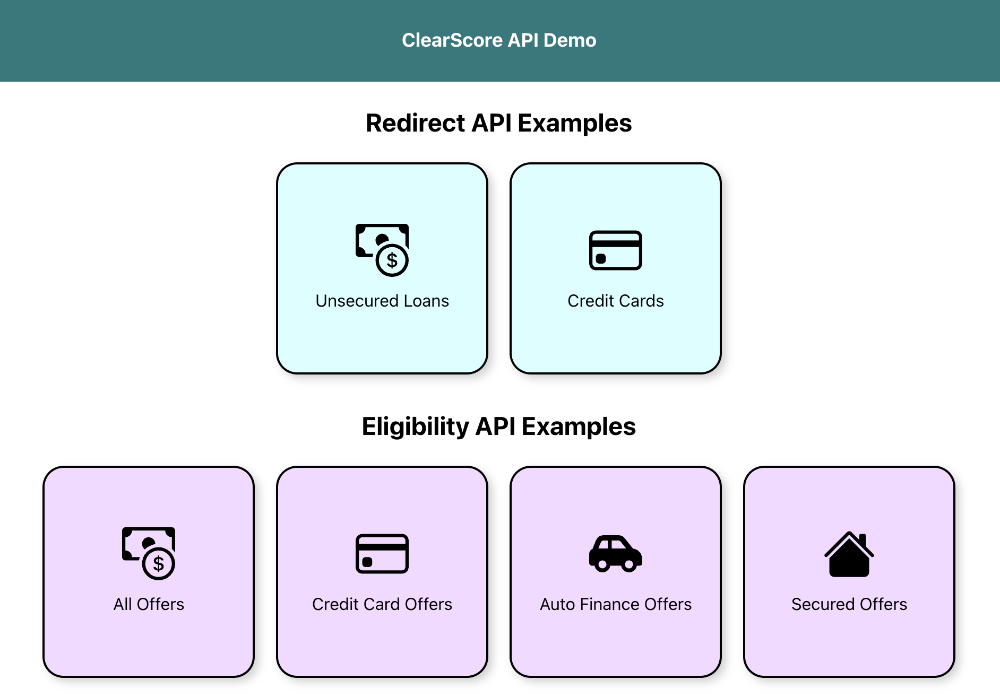

# ClearScore Partner API Sandbox Project

The purpose of this project is to provide an example of how a Partner could implement the API within a modern frontend
stack.

It *is not intended* for production (it is not optimized and doesn't necessarily use React optimizations and
recommendations).

It *is intended* to provide clarity on the:

1. The expected payload and how it is handled for each journey.
2. Basic validation expected around required fields.
3. The conditional logic around certain aspects of the form (such as if the applicant is retired).
4. How the API requests are constructed and results handled.
5. How the API results can be displayed and interacted with.

The documentation is available [here](https://developer.aro.co.uk/).

A live version of this demo can be found [here](https://partner-api-demo.freedom-finance-test.cloud/DemoMenu)

## Adding your API Bearer Token to the Environment

**If you want to skip this step, then mocked responses will be returned instead (the API will not be invoked).**

To execute the API and see real results you should request (and have been supplied with) credentials for the ClearScore
Sandbox environment.

If you do not have these, please liaise with <u>ClearScore Partner Services</u>.

The token should be added into a file called `.env.local` that you should create in the root of the project folder,
and in the following format:

```
NEXT_PUBLIC_API_BEARER_TOKEN=<token starting ey...>
NEXT_PUBLIC_API_KEY=<api key>
```

## Specifying API Bearer Token & API Key at Runtime

If you have not specified your API Bearer Token and API Key within the environment, it is possible to set them at
runtime and still see real API responses.

Please note that for the Redirect API only an API Bearer Token (in JWT format) is required, whereas for the Eligibility
API an additional API Key is also required. Please refer to the online API documents for more information.

This option will only be available if the environment variable defined above **is not** specified.

When running the app, there should be an option available on the top-right, as follows:


Clicking this button will show an input field where you can paste your bearer token. This will be the token supplied
to you that starts "ey".


After entering a valid token, the lock should close. Now whenever you make API requests the token will be used.


## Getting Started for Development

Next, run the development server:

```bash
npm i next
npm run dev
```

Open [http://localhost:3000/DemoMenu](http://localhost:3000) with your browser to test that the application runs OK.

You will be presented with a menu page as follows that allows you to access each of the journeys supported by the APIs:



Alternatively you can access each journey individually:

1. [http://localhost:3000/UnsecuredForm](http://localhost:3000/UnsecuredForm) for the Redirect Loan journey
1. [http://localhost:3000/CardForm](http://localhost:3000/CardForm) for the Redirect Credit Card journey
1. [http://localhost:3000/EligibilityAll](http://localhost:3000/CardForm) for the Eligibility All Offers journey
1. [http://localhost:3000/EligibilityCard](http://localhost:3000/CardForm) for the Eligibility Credit Card journey
1. [http://localhost:3000/EligibilityAutoFinance](http://localhost:3000/CardForm) for the Eligibility Auto Finance
   journey
1. [http://localhost:3000/EligibilitySecured](http://localhost:3000/CardForm) for the Eligibility Secured journey

## Running a Production Build

A faster Production build can be run using these commands:

```bash
npm run build
npm start
```

## Form Validation

Simple form validation (such as required fields) is switched on by default. It can be useful to be able to play with the
data and observe how the API responses changes, so for this reason it is possible to *switch off* validation so that
fields can be left empty or have invalid data.

You can toggle whether validation is available by using the switch at the bottom of the form:


## Some Useful Info

1. Form data is pre-populated to make it easier to work with the APIs - you can change the field data per your own needs
    - This includes the `Partner Code` field that you can populate with your own code when supplied by ClearScore, which
    - along with the Sandbox API token to allow you to make API calls and use the Lending Panel configured for your
    - account.
1. Use the Left and Right cursor keys to quickly navigate the UI (without the need to find and click the Back and
   Continue buttons) - make sure you're not focused on a UI field though
1. The UI has been built to be responsive and will also work on a mobile (or small screen) device

## Components

Bootstrapping common components from TailWindCSS.

## ClearScore Sandbox API

It currently uses [`next.config.js`] to bypass CORS for local development.

## Upgrading NextJS version

```
npm i next@latest react@latest react-dom@latest eslint-config-next@latest
```